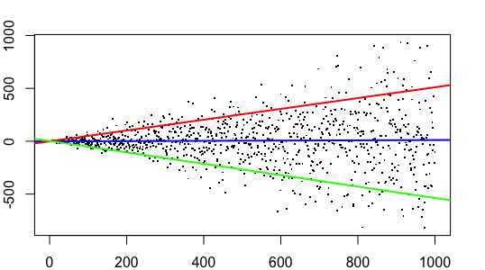

[](http://quantlet.de/)

## [](http://quantlet.de/) **QNN_QR** [](http://quantlet.de/)

```yaml

Name of Quantlet : QNN_QR

Published in : 'QNN'

Description : 'Simulates heteroscedastic data and fits the 10% quantile, median and 90% quantile.'

Keywords : Quantile regression, conditional quantile

See also : 'QNN_Loss, NNQR_CoVaR, NNQR_Heat, NNQR_Network, NNQR_SNRI'

Author : Georg Keilbar

Submitted : January 18, 2019 by Georg Keilbar

```



### R Code
```r

library(quantreg)

#Simulate heteroscedastic data
set.seed(123)
X = 1:1000
Y = rnorm(n=1000, mean=0, sd=0.4*X)

#Plot 90% quantile fit, median fit, 10% quantile fit
windows()
par(oma=c(0,0,0,0), mar=c(2,2,2,2))
plot(X,Y,pch=".",xlab="",ylab="",cex=2)
abline(coef(rq(Y~X)), col="blue",lwd=2)
abline(coef(rq(Y~X,tau=0.9)), col="red",lwd=2)
abline(coef(rq(Y~X,tau=0.1)), col="green",lwd=2)
```

automatically created on 2019-01-18